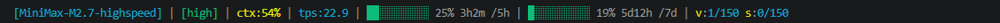

# Claude Code MiniMax 状态栏

[English](./README.md) | [中文](./README_zh.md)

---

# Claude Code MiniMax 状态栏

一款定制的 Claude Code 状态栏，显示 MiniMax API 配额使用情况、TPS 指标等。

## 效果预览



```
[MiniMax-M2.7-highspeed] | [high] | ctx:45% | tps:128.5 | ████████░░ 78% 1h14m /5h | █████░░░░░ 52% 1d18h /7d | v:45/150 s:12/100
```

## 功能特性

- **模型名称** - 显示当前 AI 模型
- **Effort 级别** - 从模型名称解析 (high/mid/low)
- **上下文使用率** - 显示上下文窗口利用率
- **TPS (Tokens Per Second)** - 测量 API 吞吐量，缓存 60 秒
- **动态配额** - 自动显示用户套餐下所有配额及进度条
- **动态颜色** - 进度条颜色随用量变化：
  - 绿色：< 50%
  - 黄色：50-79%
  - 红色：>= 80%

## 环境要求

- [mmx](https://github.com/MiniMax-AI/cli) - MiniMax CLI 工具
- [jq](https://jqlang.github.io/jq/) - JSON 处理器
- Python（需能从 PATH 或完整路径访问 mmx）
- Git Bash / MINGW64 环境 (Windows)
- Nerd Font 字体以显示 Unicode 块字符（如 FiraCode Nerd Font）

## 安装步骤

### 一键配置

```bash
curl -s https://raw.githubusercontent.com/VipMason/cc-statusline-minimax/master/statusline-command.sh -o ~/.claude/statusline-command.sh && chmod +x ~/.claude/statusline-command.sh && cat ~/.claude/settings.json | jq '.statusLine={"type":"command","command":"~/.claude/statusline-command.sh"}' > /tmp/settings.json && mv /tmp/settings.json ~/.claude/settings.json && echo "配置完成，重启Claude Code生效"
```

### 手动配置

#### 1. 克隆或复制脚本

```bash
git clone https://github.com/VipMason/cc-statusline-minimax.git
```

#### 2. 配置 Claude Code 设置

在 Claude Code 的 `settings.json` 中添加：

```json
{
  "statusLine": {
    "type": "command",
    "command": "C:/Users/YOUR_USERNAME/.claude/statusline-command.sh"
  }
}
```

### 3. 自动检测（无需手动配置）

脚本会自动从 PATH 中检测 `jq`、`mmx` 和 `python`。如果找不到工具，会显示错误信息并提供安装指引。

如果自动检测失败，可在 `statusline-command.sh` 顶部设置自定义路径：
```bash
JQ="/自定义/路径/jq.exe"
MMX="/自定义/路径/mmx"
PYTHON="/自定义/路径/python"
```

#### 3. 安装依赖

**mmx:**
```bash
npm install -g @minimax-ai/mmx
mmx auth login --api-key YOUR_API_KEY
```

**jq:**
从 https://jqlang.github.io/jq/ 下载并添加到 PATH

#### 4. (可选) 安装 Nerd Font

为正确显示 Unicode 块字符，请安装 [FiraCode Nerd Font](https://github.com/ryanoasis/nerd-fonts/releases) 或其他 Nerd Font。

在 Windows Terminal 的 `settings.json` 中配置使用 FiraCode Nerd Font。

## 配置说明

### Effort 级别映射

从模型名称解析 effort 级别：
- `highspeed` 或 `high` → `high`
- `low` → `low`
- 其他 → `mid`

### 进度条颜色

| 使用量 | 颜色 |
|--------|------|
| < 50%  | 绿色 |
| 50-79% | 黄色 |
| >= 80% | 红色 |

### 配额显示

脚本显示 MiniMax-M* 主模型配额（5h 和 7d）以及 coding-plan 配额：
- `v` = coding-plan-vlm
- `s` = coding-plan-search

## 故障排查

### Unicode 字符乱码

请确保：
1. Windows Terminal 使用 Nerd Font（如 FiraCode）
2. Git Bash locale 设置为 UTF-8（`export LC_ALL=en_US.UTF-8`）

### mmx 找不到

在脚本顶部的变量中使用 `mmx.exe` 的完整路径。

### TPS 显示为 0

检查命令行中 `mmx text chat` 是否正常工作，以及 Python 能否解析 JSON 输出。

## 开源许可

MIT
